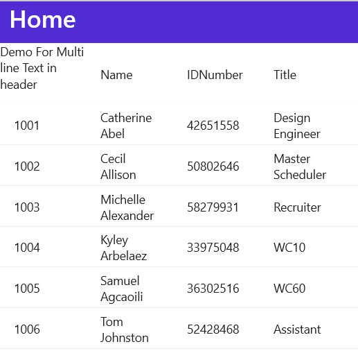

# Show Multi line Header Text in MAUI DataGrid
In.NET [MAUI DataGrid](https://www.syncfusion.com/maui-controls/maui-datagrid) (SfDataGrid) allows you to customize the header text for a column using the [HeaderText](https://help.syncfusion.com/cr/maui/Syncfusion.Maui.DataGrid.DataGridColumn.html#Syncfusion_Maui_DataGrid_DataGridColumn_HeaderText) property. However, by default, the grid only displays one line of text in the header, and any longer header text will be clipped and show an ellipsis at the end.

To display longer header text, you can use the [HeaderTemplate](https://help.syncfusion.com/cr/maui/Syncfusion.Maui.DataGrid.DataGridColumn.html#Syncfusion_Maui_DataGrid_DataGridColumn_HeaderTemplate) property in the [DataGridColumn](https://help.syncfusion.com/cr/maui/Syncfusion.Maui.DataGrid.DataGridColumn.html). This property replaces the default header view, and you can use it to display a label with the `LineBreakMode` property set to `WordWrap`. This will wrap the header text to the next line. Additionally, you can use the [HeaderRowHeight](https://help.syncfusion.com/cr/maui/Syncfusion.Maui.DataGrid.SfDataGrid.html#Syncfusion_Maui_DataGrid_SfDataGrid_HeaderRowHeight) property to adjust the header row height as needed, depending on the length of your header text.
Refer the below code example which illustrates how to show multiline header in SfDataGrid.

## XAML
```XAML
<ContentPage.BindingContext>
        <local:EmployeeViewModel x:Name="viewModel"/>
    </ContentPage.BindingContext>
<syncfusion:SfDataGrid x:Name="dataGrid"
                        ItemsSource="{Binding Employees}" HeaderRowHeight="70">
    <syncfusion:SfDataGrid.Columns>
        <syncfusion:DataGridTextColumn MappingName="EmployeeID">
            <syncfusion:DataGridTextColumn.HeaderTemplate>
                <DataTemplate>
                    <Label x:Name="PatientName" Text="Demo For Multi line Text in header"
                TextColor="Black" VerticalOptions="Fill"
                LineBreakMode="WordWrap"  />
                </DataTemplate>
            </syncfusion:DataGridTextColumn.HeaderTemplate>
        </syncfusion:DataGridTextColumn>
    </syncfusion:SfDataGrid.Columns>
</syncfusion:SfDataGrid>
```

### Conclusion
I hope you enjoyed learning about how to bind DataTable collection to MAUI DataGrid (SfDataGrid).
You can refer to our [.NET MAUI DataGrid’s feature tour](https://www.syncfusion.com/maui-controls/maui-datagrid) page to know about its other groundbreaking feature representations. You can also explore our .NET MAUI DataGrid Documentation to understand how to present and manipulate data.
For current customers, you can check out our .NET MAUI components from the [License and Downloads](https://www.syncfusion.com/account/downloads) page. If you are new to Syncfusion, you can try our 30-day free trial to check out our .NET MAUI DataGrid and other .NET MAUI components.
If you have any queries or require clarifications, please let us know in comments below. You can also contact us through our [support forums](https://www.syncfusion.com/forums), [Direct-Trac](https://support.syncfusion.com/account/login?ReturnUrl=%2Faccount%2Fconnect%2Fauthorize%2Fcallback%3Fclient_id%3Dc54e52f3eb3cde0c3f20474f1bc179ed%26redirect_uri%3Dhttps%253A%252F%252Fsupport.syncfusion.com%252Fagent%252Flogincallback%26response_type%3Dcode%26scope%3Dopenid%2520profile%2520agent.api%2520integration.api%2520offline_access%2520kb.api%26state%3D8db41f98953a4d9ba40407b150ad4cf2%26code_challenge%3DvwHoT64z2h21eP_A9g7JWtr3vp3iPrvSjfh5hN5C7IE%26code_challenge_method%3DS256%26response_mode%3Dquery) or [feedback portal](https://www.syncfusion.com/feedback/maui?control=sfdatagrid). We are always happy to assist you!
